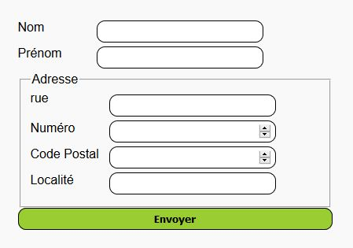

# Les pseudos-classes

## Exercice 1

:::Tableau
```html
<table>
	<tr>
		<td>Ligne 1 - Colonne 1</td>
		<td>Ligne 1 - Colonne 2</td>
		<td>Ligne 1 - Colonne 3</td>
	</tr>
	<tr>
		<td>Ligne 2 - Colonne 1</td>
		<td>Ligne 2 - Colonne 2</td>
		<td>Ligne 2 - Colonne 3</td>
	</tr>
	<tr>
		<td>Ligne 3 - Colonne 1</td>
		<td>Ligne 3 - Colonne 2</td>
		<td>Ligne 3 - Colonne 3</td>
	</tr>
	<tr>
		<td>Ligne 4 - Colonne 1</td>
		<td>Ligne 4 - Colonne 2</td>
		<td>Ligne 4 - Colonne 3</td>
	</tr>
	<tr>
		<td>Ligne 5 - Colonne 1</td>
		<td>Ligne 5 - Colonne 2</td>
		<td>Ligne 5 - Colonne 3</td>
	</tr>
	<tr>
		<td>Ligne 6 - Colonne 1</td>
		<td>Ligne 6 - Colonne 2</td>
		<td>Ligne 6 - Colonne 3</td>
	</tr>
	<tr>
		<td>Ligne 7 - Colonne 1</td>
		<td>Ligne 7 - Colonne 2</td>
		<td>Ligne 7 - Colonne 3</td>
	</tr>
	<tr>
		<td>Ligne 8 - Colonne 1</td>
		<td>Ligne 8 - Colonne 2</td>
		<td>Ligne 8 - Colonne 3</td>
	</tr>
	<tr>
		<td>Ligne 9 - Colonne 1</td>
		<td>Ligne 9 - Colonne 2</td>
		<td>Ligne 9 - Colonne 3</td>
	</tr>
</table>
```
:::

Pour cette exercice, il faut : 
- mettre une bordure et une marge interne sur chaque case du tableau.
- colorier le fond des lignes impaires du tableau.
- colorier le texte de la dernière ligne du tableau.

@[Exerice 1]({"stubs": ["css/style.css"], "command": "/bin/bash run.sh table.html css/style.css css/table.css"})

## Exercice 2

::: Formulaire
```html
<form action="" method="post">
	<label for="nom">Nom</label>
	<input type="text" name="nom" id="nom" required>
	<label for="prenom">Prénom</label>
	<input type="text" name="prenom" id="prenom" required>
	<fieldset>
		<legend>Adresse</legend>
		<label for="rue">rue</label>
		<input type="text" name="rue" id="rue">
		<label for="num">Numéro</label>
		<input type="number" name="num" id="num">
		<label for="cp">Code Postal</label>
		<input type="number" name="cp" id="cp">
		<label for="loc">Localité</label>
		<input type="text" name="loc" id="loc">
	</fieldset>
	<input type="submit" value="Envoyer">
</form>
```
:::

Pour cet exercice, il faut :

:::Résultat

:::

:::Propriétés utiles
- Toutes celles déjà rencontrées
- [`display`](https://www.w3schools.com/cssref/pr_class_display.asp) 
- [`float`](https://www.w3schools.com/cssref/pr_class_float.asp) 
- [`border-radius`](https://www.w3schools.com/cssref/css3_pr_border-radius.asp)
- Informations complémentaire sur les [`form` et le CSS](https://www.w3schools.com/css/css_form.asp)
:::

@[Exerice 2]({"stubs": ["css/style.css"], "command": "/bin/bash run.sh form.html css/style.css css/form.css"})